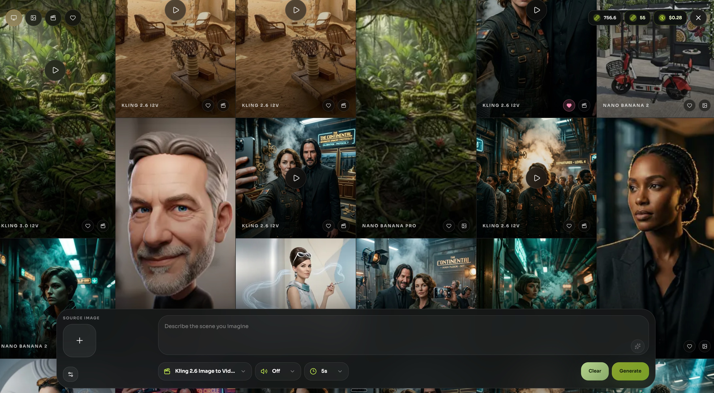

# Media Studio

Media Studio is a local AI artist studio for images and videos.

It gives you a gallery, prompt box, source-image slot, model picker, presets, and local output history in one place. You run the app locally, keep your prompts and outputs on your own machine, and connect it to [Kie AI](https://kie.ai?ref=e7565cf24a7fad4586341a87eaf21e42) for pay-as-you-go model access.

[Kie AI](https://kie.ai?ref=e7565cf24a7fad4586341a87eaf21e42), pronounced "key AI," is the external AI model marketplace and API platform behind Media Studio. It gives developers access to image, video, music, speech, and LLM models through one provider, and its public pages describe a credit-based pay-as-you-go system instead of a monthly subscription. Current Kie AI pages say entry-level purchases start at $5, and some model pages describe 1,000 credits for $5, with each model consuming its own amount of credits.



If you want the fastest path first:

- [START_HERE.md](START_HERE.md)

## What Is This About?

This repo is for people who want their own image and video studio instead of another subscription-hosted tool website.

You run the dashboard locally, connect your own Kie AI key, and get:

- your own gallery-style studio UI
- your own presets and prompt workflows
- your own queue, jobs, and output history
- your own local files and artifacts

It is local-first by design. It is not trying to be a one-click hosted SaaS template.

Important: the dashboard and queue run locally, but the image and video models do not run on your machine. Media Studio sends generation jobs to Kie AI, which is the external model marketplace and provider used for live generation.

The local control API is intentionally private by default. The setup scripts generate a unique local control token and keep the Studio locked to localhost unless you explicitly configure browser credentials.

## Why Was It Built?

Most AI media tools make you rent the whole product just to access the models.

Media Studio was built to make that layer yours instead:

- the app and workflow stay under your control
- the backend is real Python, not a toy mock layer
- the pricing stays usage-based through Kie AI
- image and video generation live in one place

## What Does It Use Under the Hood?

- `Next.js` for the dashboard and browser-facing routes
- `FastAPI` for the local control API
- `SQLite` for jobs, batches, presets, queue state, and local metadata
- `kie-api` for model registry, request validation, pricing, submit, polling, and artifacts
- local filesystem storage for uploads, downloads, and generated outputs

The main repo layout is:

```text
apps/
  api/   FastAPI backend
  web/   Next.js frontend
packages/
  provider-adapter/
  shared-types/
scripts/
docs/
data/
```

## What Provider Are We Using?

Right now the live generation path is Kie AI, pronounced "key AI."

That means:

- you bring your own `KIE_API_KEY`
- Media Studio uses the shared `kie-api` layer to talk to Kie AI
- pricing, validation, and request normalization are driven from the Kie AI-backed registry
- the models are executed remotely through Kie AI, not locally on your Mac, Linux box, or Windows machine

Kie AI is the model marketplace behind the app. It uses a credit-based, pay-as-you-go system instead of a monthly subscription.

As of April 3, 2026, Kie AI pages describe entry-level credit purchases starting at $5, and some current model pages cite 1,000 credits for $5. Different models consume different amounts of credits, so image and video jobs do not all cost the same. Check the provider site before making pricing promises, because Kie AI can change packs and pricing over time.

Get your Kie AI key here:

- [kie.ai](https://kie.ai?ref=e7565cf24a7fad4586341a87eaf21e42)

## How Does The System Work?

At a high level, the system works like this:

- you browse the gallery and open the Studio composer
- you choose a model, add a prompt, and optionally attach a source image
- you can use a preset to fill in a repeatable workflow instead of starting from scratch
- the local app validates and stores the job
- Kie AI runs the model remotely and sends back the result
- the finished output lands back in your gallery and local files

That is the main idea: local studio experience, remote model execution, local history.

## What Models Are In The Studio Right Now?

Current image models:

- `nano-banana-2`
  General image generation and image editing. This is the default image model in the Studio.
- `nano-banana-pro`
  Higher-end Nano Banana variant for image generation and image editing.

Current video models:

- `kling-2.6-t2v`
  Text-to-video generation from a prompt only.
- `kling-2.6-i2v`
  Image-to-video generation from a single starting image.
- `kling-3.0-t2v`
  Newer Kling text-to-video flow.
- `kling-3.0-i2v`
  Newer Kling image-to-video flow, including first/last-frame style input handling in the Studio.
- `kling-3.0-motion`
  Motion-control workflow for guiding video movement from source media.

The exact pricing and request rules can change over time, so the app also exposes:

- `/pricing` in the dashboard
- `GET /media/pricing` in the control API

## Nano Banana And Presets

Nano Banana is the core image workflow in the Studio right now.

The app currently ships with:

- `nano-banana-2` as the default image model
- `nano-banana-pro` as the higher-end image variant
- shared built-in Nano Banana presets to show how guided image workflows work out of the box

The preset system is one of the best parts of the product.

A preset is not just a saved prompt. A preset can define:

- which models it applies to
- a reusable prompt template
- structured text inputs like names, characters, scenes, or style fields
- required image slots such as a portrait or reference image
- default options that should be applied automatically
- thumbnails, notes, and model-specific guidance

That means you can build repeatable workflows instead of rewriting the same prompt every time.

In practice, presets make the studio feel more like a small creative tool than a raw API front end.

Examples already seeded into the app:

- `3D Caricature Style`
  Upload a portrait and turn it into a stylized 3D caricature.
- `Selfie with Movie Character`
  Upload your photo, add an actor and movie name, and generate a guided selfie-style composition.

## How Do I Set This Up Quickly?

Minimum requirements:

- `git`
- `python3`
- `npm`
- `KIE_API_KEY` from Kie AI

### macOS

```bash
git clone https://github.com/gateway/media-studio.git
cd media-studio
./scripts/onboard_mac.sh
```

That script:

- clones or reuses the shared `kie-api` repo
- creates the shared Python virtualenv
- installs Python and web dependencies
- creates `.env`
- creates a clean local database
- prompts for `KIE_API_KEY`

Then run:

```bash
npm run dev:api
npm run dev:web
```

Open:

- `http://127.0.0.1:3000/setup`
- `http://127.0.0.1:3000/studio`

The first real step to use the models is simple:

- create a Kie AI account and get your `KIE_API_KEY`
- add that key during setup
- start the API and web app
- open `/studio`
- choose a model or preset
- submit your first job

The shortest version is:

1. Get a Kie AI key.
2. Run the setup script.
3. Open the Studio.
4. Pick a model.
5. Prompt and generate.

### Linux

The macOS installer is macOS-only. For Linux, use the shared bootstrap directly:

```bash
git clone https://github.com/gateway/media-studio.git
cd media-studio
./scripts/bootstrap_local.sh
```

Then add your `KIE_API_KEY` to `.env` and run:

```bash
npm run dev:api
npm run dev:web
```

### Windows

```powershell
git clone https://github.com/gateway/media-studio.git
cd media-studio
powershell -ExecutionPolicy Bypass -File .\scripts\onboard_windows.ps1
```

Detailed setup docs:

- [docs/getting-started-mac.md](docs/getting-started-mac.md)
- [docs/getting-started-windows.md](docs/getting-started-windows.md)

## Prompt Enhancement

Prompt enhancement is optional.

You can use Media Studio with only `KIE_API_KEY` and nothing else.

If you want prompt rewriting or enhancement before generation, you can also configure:

- `OPENROUTER_API_KEY` for hosted prompt enhancement
- `MEDIA_LOCAL_OPENAI_BASE_URL` for a local OpenAI-compatible endpoint
- `MEDIA_LOCAL_OPENAI_API_KEY` if that local endpoint requires auth

By default, the OpenRouter enhancement path is wired to `qwen/qwen3.5-35b-a3b`, and the enhancement layer can also work with supported multimodal models when you want image-aware prompt help.

These are helpers for prompt quality. They are not required for the core image or video generation flow.

## Miscellaneous Things To Know

- The app is local-first and works best as a localhost studio.
- The shared Python runtime lives in the sibling `kie-api` checkout, so Media Studio does not need its own separate Python venv.
- The setup flow supports both `../kie-api` and legacy `../kie-ai/kie_codex_bootstrap` layouts.
- If you skip `KIE_API_KEY` during setup, the app still installs, but live generation stays off until you add the key.
- The local app stores prompts, jobs, and output files on your machine, but the actual model generation happens through Kie AI.
- Runtime files such as databases, downloads, uploads, and outputs stay local and should not be committed.

For deeper runtime details:

- [docs/runtime-and-supervision.md](docs/runtime-and-supervision.md)

## Start Here

If you are a person setting this up for the first time:

- [START_HERE.md](START_HERE.md)

If you are pointing an LLM or another helper at the project and want the fastest onboarding context:

- [START_HERE.md](START_HERE.md)
- [docs/getting-started-mac.md](docs/getting-started-mac.md)
- [docs/runtime-and-supervision.md](docs/runtime-and-supervision.md)
