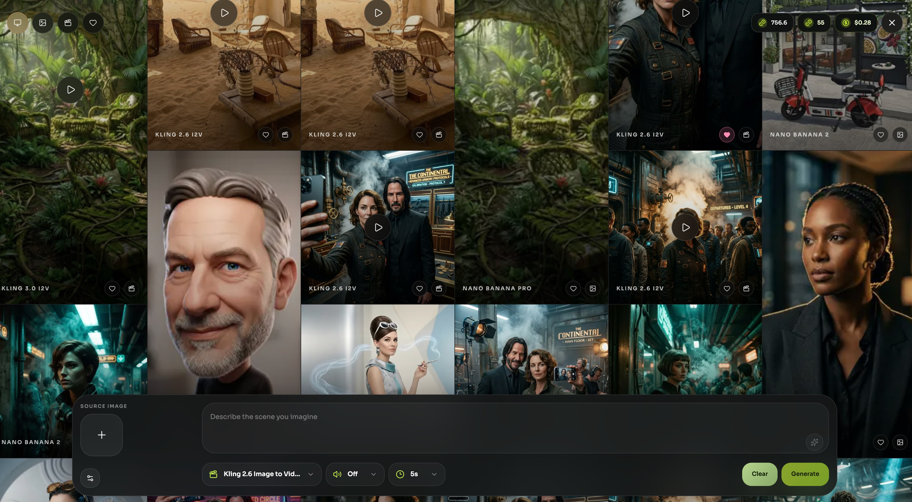

# Media Studio

**Create images, direct video, and build soundtracks in one local workspace.**

Media Studio brings AI generation, a searchable media library, reusable presets, and visual workflows together. Make a product shot, develop a character, plan a storyboard, animate a scene, or turn a creative process into something you can run again.

Choose from GPT Image, Nano Banana, Seedance, Kling, and Suno through [Kie AI](https://kie.ai?ref=e7565cf24a7fad4586341a87eaf21e42). Your projects, saved prompts, presets, references, and generated files live on your machine, with generation requests sent to the selected providers.



[Install](#install-and-start) · [Features](#make-more-with-your-media) · [Models](#supported-models) · [Graph Studio](#graph-studio-experimental) · [Media Assistant](#media-assistant-experimental)

## Install and start

Have **Git, Python 3, and Node.js LTS** installed. For live generation, you'll also need a [Kie AI account](https://kie.ai?ref=e7565cf24a7fad4586341a87eaf21e42), an API key, and credits. You can complete setup without a key and add it later.

The onboarding helper handles dependencies, configuration, the local database, and starter presets. It prompts for your KIE API key and checks whether Codex Local is available for optional AI prompt tools.

### macOS

Install from Terminal:

```bash
git clone https://github.com/gateway/media-studio.git
cd media-studio
./scripts/onboard_mac.sh
```

Start whenever you're ready:

```bash
./scripts/run_studio_mac.sh
```

You can also double-click **Start Media Studio.command** in the project folder. Use **Stop Media Studio.command** or `./scripts/stop_studio_mac.sh` to stop it.

<details>
<summary><strong>Windows — native PowerShell setup</strong></summary>

Install:

```powershell
git clone https://github.com/gateway/media-studio.git
cd media-studio
powershell -ExecutionPolicy Bypass -File .\scripts\onboard_windows.ps1
```

Start:

```powershell
powershell -ExecutionPolicy Bypass -File .\scripts\run_studio.ps1
```

Stop:

```powershell
powershell -ExecutionPolicy Bypass -File .\scripts\stop_studio.ps1
```

[Full Windows guide](docs/getting-started-windows.md)

</details>

<details>
<summary><strong>Linux — desktop or workstation setup</strong></summary>

Install:

```bash
git clone https://github.com/gateway/media-studio.git
cd media-studio
./scripts/onboard_linux.sh
```

Start:

```bash
./scripts/run_studio_linux.sh
```

Stop:

```bash
./scripts/stop_studio_linux.sh
```

[Full Linux guide](docs/getting-started-linux.md)

</details>

The launcher starts the app and opens Studio in your browser. If the default ports are busy, it selects available ports and prints the actual URL. Video thumbnails and playback derivatives use the shared KIE API Python environment; a separate system FFmpeg installation is optional.

Need help? Start with the [macOS guide](docs/getting-started-mac.md), [prerequisites](docs/prerequisites.md), or [advanced runtime guide](docs/advanced-runtime.md).

## Make more with your media

- **Generate and revise.** Create images from text, edit images with references, animate stills, direct video with first and last frames, or guide motion with a driving clip. Model-specific controls expose the inputs and options each model supports.
- **Pick up where you left off.** Create Revision restores an earlier asset's prompt, model, settings, and reference media. Retry failed jobs or bring previous outputs back into the composer.
- **Keep a creative library.** Browse your local gallery, organize work into Projects, and reuse images from the Reference Library without losing the global view of your work.
- **Make a look repeatable.** Media Presets combine prompt templates, editable fields, image slots, model defaults, and thumbnails. Import and export bundles to share them between installs.
- **Give prompts a reusable structure.** Prompt Recipes capture LLM instructions and inputs for repeatable drafting and Graph workflows. Use Codex Local, OpenRouter, or a local OpenAI-compatible endpoint for supported prompt tasks.
- **Know what is happening.** Follow queued, running, completed, and failed jobs. Review KIE credit and USD estimates before generation; recorded spending for successful OpenRouter-backed Studio runs appears separately.
- **Own your working library.** Your database, projects, uploads, presets, and outputs stay in your local data folder. Generation and hosted AI services use their configured providers.

Starter presets include **Photo Restoration**, **3D Caricature Style**, **2x2 Pose Grid**, **Exploding Food**, **Food Recipe Infographic**, **Giant Animal Anywhere**, and **Selfie with Movie Character**. Build your own from the Presets page and choose compatible image models.

## Supported models

Media Studio reads its model catalog from the companion [`kie-api`](https://github.com/gateway/kie-api) project. These are the currently integrated image and video models exposed in Studio; the available catalog can expand as that integration is updated.

### Image generation and editing

| Model | What you can do |
| --- | --- |
| **GPT Image 2** | Text-to-image and image editing with ordered references |
| **GPT Image 2.5 Flare** | Text-to-image and image editing |
| **GPT Image 2.5 Sunburst** | Text-to-image and image editing |
| **Nano Banana 2** | Text-to-image and image editing |
| **Nano Banana Pro** | Text-to-image and image editing |

### Video generation and motion

| Model | What you can do |
| --- | --- |
| **Seedance 2.0 Standard** | Text-to-video, image-to-video, first/last frames, and multimodal references |
| **Seedance 2.0 Fast** | Text-to-video, image-to-video, first/last frames, and multimodal references |
| **Seedance 2.0 Mini** | Text-to-video, image-to-video, first/last frames, and multimodal references |
| **Seedance 2.5** | Text-to-video, image-to-video, first/last frames, and multimodal references |
| **Kling 2.6** | Text-to-video, image-to-video, and motion control using an image and driving video |
| **Kling 3.0** | Text-to-video, image-to-video with optional end frame, and motion control |
| **Kling 3.0 Turbo** | Image-to-video with start and optional end frames |

### Music in Graph Studio

**Suno Music Generation** is available as a Graph Studio model node. Build music workflows with audio previews, saved tracks, and local audio processing. Suno is a Graph capability rather than a model in the main Studio image/video composer.

Use **Models** for the current catalog and supported options, and **Pricing** for cost estimates. Kie can change availability, rules, and credit costs; displayed prices are estimates and the final charge is determined by Kie.

Media Studio is not affiliated with Kie AI. The Kie links above are affiliate links that help support the project.

## Graph Studio (experimental)

Build the pipeline behind the result. Graph Studio connects prompts, references, AI models, previews, and saved outputs on a visual canvas.

- Chain image generation into video, reuse existing images, and connect Prompt Recipes or Media Presets to model runs.
- Compile storyboards, create storyboard sheets, slice image grids, and organize scenes with groups and notes.
- Trim, resize, and convert video; combine ordered clips with optional transitions; extract frames, audio, or metadata.
- Trim, convert, normalize, and inspect audio, including music created through Suno.
- Review estimates and run diagnostics, then save workflows locally or export portable templates for another install.

Graph Studio and Prompt Recipe graph execution remain experimental. See the [node library](docs/graph-studio-node-library.md) for the current building blocks.

## Media Assistant (experimental)

Turn a creative brief into something you can review and build. Media Assistant can inspect your workflow, help develop characters and environments, organize storyboards and shots, propose graph changes, and help draft Media Presets and Prompt Recipes.

It keeps requests with their original workflow when you switch tabs. Returning or reloading restores saved replies or active progress and Stop controls. Failed requests retain their text and recovery options, and replies preserve creative details, numbering, line breaks, and literal snippets.

Graph proposals are reviewed before you apply them. Applying graph changes and starting a generation run are separate actions, so you can inspect the canvas and cost before proceeding.

Media Assistant is an opt-in pilot and currently requires a ready local Codex CLI/App Server login. To enable it, add this to `.env` and restart Media Studio:

```env
NEXT_PUBLIC_MEDIA_STUDIO_ASSISTANT_DEBUG=1
```

The Assistant entry in Graph Studio shows setup guidance until its requirements are met. Follow [Media Assistant setup](docs/media-assistant-setup.md) for the full path. Normal Studio generation and manual Graph workflows work without Codex.

## AI prompt tools

Configure optional text and vision providers in **Settings → AI** (`/settings/llms`):

- **Codex Local** uses your local Codex login for prompt enhancement, Prompt Recipe drafting, and Graph prompt nodes.
- **OpenRouter** provides hosted prompt enhancement and drafting, with recorded usage spending for supported Studio calls.
- **Local OpenAI-compatible endpoints** let you connect a configured endpoint for supported prompt workflows.

These providers support prompt work; image, video, and music generation use their KIE model nodes or Studio generation models. See [Media Assistant setup](docs/media-assistant-setup.md) for the Assistant's distinct runtime requirements.

## Shortcuts

| Input | Action |
| --- | --- |
| `G` | Open Projects |
| `N` | Open Graph Studio |
| `P` | Open Presets |
| `S` | Open Settings |
| `C` | Toggle the bottom console |
| `M` | Minimize or restore Media Assistant in Graph Studio |
| `Cmd/Ctrl+Z` | Undo |
| Right-click empty Graph canvas | Open node search at the pointer |
| Drag between ports | Connect nodes |

[Full keyboard and mouse controls](docs/keyboard-mouse-controls.md)

## Guides

- [Start here](START_HERE.md)
- [macOS setup](docs/getting-started-mac.md) · [Windows setup](docs/getting-started-windows.md) · [Linux setup](docs/getting-started-linux.md)
- [Media Assistant setup](docs/media-assistant-setup.md) · [Media Assistant details](docs/media-assistant.md)
- [Graph node library](docs/graph-studio-node-library.md)
- [Advanced runtime](docs/advanced-runtime.md) · [Pricing integration](docs/pricing-integration.md)
- [Release notes](docs/releases/v1.0.4.md)

## License

Media Studio is source-available for non-commercial use under the terms in [LICENSE](LICENSE) and [ADDITIONAL_TERMS.md](ADDITIONAL_TERMS.md).

You may install it, run it, study it, modify it, and use it to make creative work for non-commercial purposes. Commercial use requires prior written approval. For commercial licensing, contact [@gateway on X](https://x.com/gateway).

AI coding assistants may be used to understand, debug, modify, or contribute to this project within the allowed license scope. They may not be used to copy substantial parts of this codebase into another project, train a model on it, or recreate it for redistribution without prior written permission.
